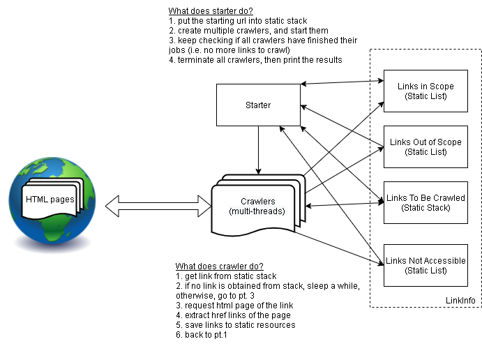

# Web Crawler
A multi-threaded web crawler to dig out all href attribute in html web pages drilled recursively from a given starting URL.

## Prerequisites
* Java Runtime 1.8 or above
* Network connection

## Run by Command Line
* Windows: double click `output/run.bat` to run it.

* Linux: type `./output/run.sh` in terminal to run it, make sure the file is granted with `execute` permission using chmod command.

You can modify the script by 
* updating the starting url, or 
* specifying an optional number of threads (default 8)

Command format is either
```
    java -jar crawler.jar <starting url>
```
or
```
    java -jar crawler.jar <starting url> <number of threads>
```

## Program Flow


## Special Handling
* When a HTTP request is responsed with code `404` (Not Found) or `403` (Forbidden) is returned, the cralwer will not process the link further.
* When a HTTP request is responsed with codes other than `404`, `403` and `200`, they will be put back to stack and re-process later in case it is caused by network issues.